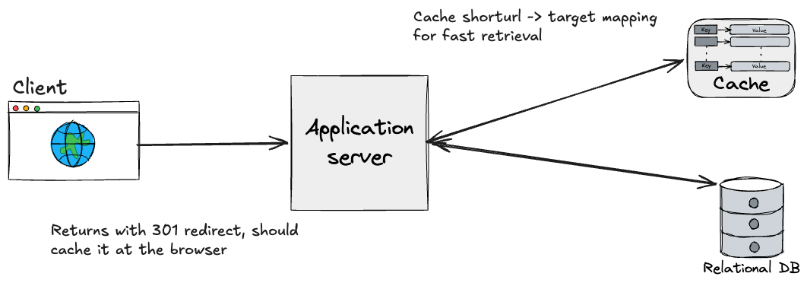
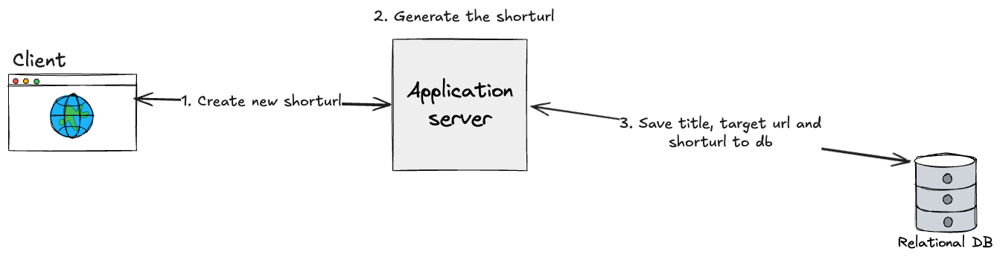
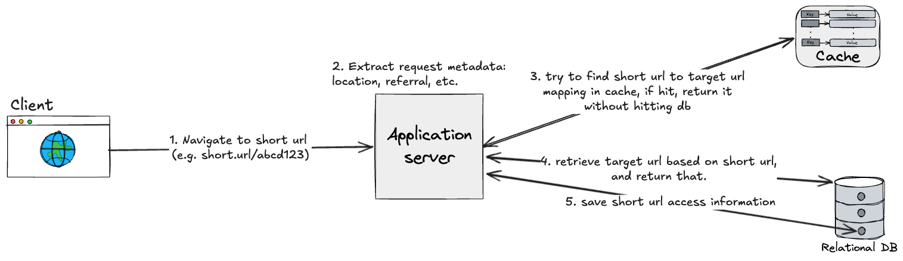
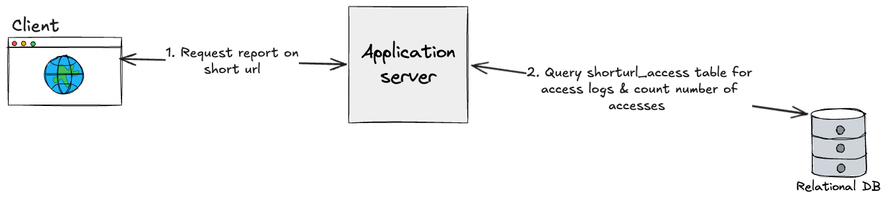

# Wiki

This is the wiki for [`myownl.ink`](https://myownl.ink).

## Architecture

### Create new shorturl

### Accessing the shorturl

### Get report for a shorturl

## Limitations

### Geocoding API Rate Limits

Currently the `geocoder`'s geocoding API is using a free default of `nominatim`, which limits to 1 request a second. This will become problematic when the amount of user scales up, and as such should be switched to a paid API with more limits in production deployment.

## Scaling
